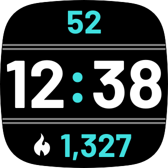

# fitbit-big-time
A simple clockface that demonstrates settings (including `ImagePicker`), file transfer and AOD.

This repository only contains code for the SDK5 (Versa 3 and Sense) build.

You can install this clockface from the [Fitbit gallery](https://gallery.fitbit.com/details/f0bdea7c-6efd-4387-a360-480aaa632d75).

appUUID
---
If you want to upload a project based on this code to the Fitbit Gallery App Manager, you may need to generate a new `appUUID` for `package.json`. This may also be needed for installation in Fitbit Studio.

AOD
---
This clockface contains code to use AOD mode. You can study and test this using the Fitbit Simulator. However, unless Fitbit has granted you permission to publish AOD products, you will not be able to install this clockface with AOD on a watch. To install on a watch, remove the `access_aod` permission from `package.json`.

I am not aware of any process by which developers can seek permission from Fitbit to publish AOD products. The normal arrangement is for Fitbit to approach developers they select.